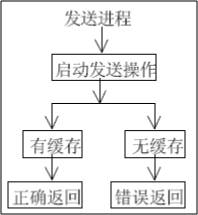

# MPI总结

本文主要是了解MPI的编程模式和基本接口之后写下的一份总结，是基于Intel IMP Python的

关于MPI：MPI是信息传递接口(Message Passing Interface),简单来说就是一个用来实现进程间通讯的库的标准。它很多时候用于并行算法的设计。现有一些不同的版本库: OpenMPI, MPICH 以及硬件商特化的 MPI 等。


## 编程模式的总结:

同样一份代码，其实会被多个进程所执行（实际的分布式环境应该是多台机器上的多个进程）。

为了标识每一个进程，这个执行同一份代码的进程群组中的每一个进程必须有自己的一个类似ID标识符这样的东西，这里称之为 Rank。而这样一个群组就是一个通信组 Group，一个 Group 之间的进程可以互相通信。执行同一份代码的所有进程就组成了一个Group对象，叫做 comm_WORLD ，在这个 Group 下，还可以自己创建 Group。

每个进程都有若干个通信子，这个通信子对象主要是用于标识它在不同 Group 之中的身份。比如说，每个进程在不同的 Group 可能会有不同的 Rank 。

在同一份代码中，Group 中可能不同的进程要执行不同的事情，我们可以通过判断 Rank 来进行判断和控制，比如:

```python
comm = MPI.COMM_WORLD  
comm_rank = comm.Get_rank()  
comm_size = comm.Get_size()  
if comm_rank == 0:  
    // do something 1  
else:  
    //do somethins 2  
```
分布式计算还有一个非常重要的特性就是要在进程间通信。MPI 中都封装好了常用的点对点通信，广播，散播。在点对点通信中，和传统的网络通信模型一样，会有阻塞与非阻塞，是否有缓冲区的分类。


## 编程接口的总结（基于Python）

1. 通信子的获取:

    `comm = MPI.COMM_WORLD`

    得到基于全局的通信子，包含了执行该程序的所有进程。类似的还有两个系统默认创建的通信子:

    COMM_SELF : 仅仅包含了当前进程

    COMM_NULL : 则什么进程都没有包含.

    在通信组中，通过通信子获取rank和size:


```python
 comm = MPI.COMM_WORLD  
 comm_rank = comm.Get_rank()         
 comm_size = comm.Get_size()  
```

2. 点对点通信

    - 标准版本(阻塞 无缓冲)

       ​	Python的 mpi4py库 通过下面两个函数提供了点对点通讯功能:     

       ```python
       Comm.Send(data, process_destination)
       ```

         	通过它在交流组中的排名来区分发送给不同进程的数据

       ```python
         Comm.Recv(process_source)
       ```

       ​	接收来自源进程的数据，也是通过在通信组中的rank来区分的

        	注意： comm.send() 和 comm.recv() 函数都是阻塞的函数。他们会一直阻塞调用者，直到数据使用完成。

       ​

    - 同步模式	

       	在同步模式中，只有函数真正的结束发送/接收任务之后才会返回

      ​	 

      ​

    - 阻塞有缓冲版本

      ​	通过返回值接收数据会多了一次数据拷贝的操作，效率较低。MPI中提供了带buffer参数的点对点通信函数:

      ```python
        comm.Send([data, type], dest)  
        comm.Recv([buf,type], source) 
      ```

       	这里data是一个 numpy.array，包含了需要传输的数据，type则是这个数据的类型，典型值有	MPI.INT，dest分别是源进程rank和目的进程rank。

       	 

    - 非阻塞有缓冲版本

      ​	点对点通信里的recv函数是一个阻塞函数,也就是接收方要等发送方发送了信息,函数才能返回。 那么对应的,非阻塞型函数就是,不管发送方是否发送了信息,函数都马上返回,返回一个request对象。我们可以通过request对象来测试发送方是否发送了信息。

      ```python
      comm.Isend([data, MPI.INT], dest)    
      comm.Irecv([data, MPI.INT], source)  
      ```

      ​	参数都是和Send和Recv的参数一致
      
      ​	执行完上述函数后，调用request.Test()来得知 信息是否发送(接收)完毕

    - probe

      ​	probe函数是用来探查当前进程是否收到消息的

      ​	阻塞版本的probe必须在收到消息后才返回,返回一个true.而非阻塞版本的iprobe则是马上返回一个true或者false,true表示有消息,false则是没有消息.

      ```python
      comm.iprobe(source, tag, status)
      ```

      ​	第一个参数是source,用来限制发送方,默认是all.

      ​	第二个参数是tag,用来限制tag.其实在之前的许多函数里都有tag参数,它是int类型,用来给消息打标签,来区分不同的消息.默认也是all.

      ​	第三个参数是status,它是一个output参数,就是说你给它传递一个空的status对象,函数返回后这个status对象会存放一些返回信息,

      ​	probe函数只是针对点对点通信的探查

3. 集体通信:

   ​	在 mpi4py 模块中，只提供了阻塞版本的集体通信接口（阻塞调用者，直到缓存中的数据全部安全发送。）

  - bcast 广播

    

    ​		Python的 mpi4py 模块通过以下的方式提供广播的功能：

    ```python
    buf = comm.bcast(data_to_share, rank_of_root_process)
    ```

    ​		这个函数将data_to_share发送给属于 comm 通讯组其他的进程，每个进程必须通过相同的 root 和 comm 来调用它。comm通信组内的每个进程调用完该函数后都会接受到 data_to_share （包括root进程）。参数 data_to_share 为 None 表示接受广播信息。

  - scatter 散播

    

       	和广播类似，散播向每个监听的进程发送数据，不过每个数据并不是都相同的。常用的场景，是将一个列表里面的数据分别发送给若干个进程。

       	comm.scatter 函数接收一个array，根据进程的rank将其中的元素发送给不同的进程。比如第一个元素将发送给进程0，第二个元素将发送给进程1，等等。

       	mpi4py 中的函数原型如下：

       ```python
    recvbuf  = comm.scatter(sendbuf, rank_of_root_process)
       ```

       	注意， comm.scatter 有一个限制，发送数据的列表中元素的个数必须和接收的进程数相等，否则会报错。

  - gather聚集

    
       gather 函数基本上是 scatter 的反操作，即收集所有进程发送向root进程的数据。 

       mpi4py 实现的 gather 函数如下：

    ```python
    recvbuf  = comm.scatter(sendbuf, rank_of_root_process)
    ```

       sendbuf 是要发送的数据， rank_of_root_process 代表要接收数据进程。

  - reduce规约

    它相当于在收集的过程中不断地进行两元运算,最终在接收方那里只有一个值，而不是一个列表.

    ```python
    n = comm_rank  
    data = comm.reduce(n, root = 0, op = MPI.SUM)  
    ```

       这里只是简单地得到rank的和，更常用的场景是，每个进程进行一定的计算，将结果操作在一起(可能求和，求最大值，求最小值等)。这样就可以把一个进程串行操作花费的时间 平摊 给若干个进程，降低运行时间。最后只有 root 进程会得到运算的最终结果

  - AllGather

     其实 AllGather = gather + bcast，

       gather中只有根进程会得到收集到的信息, 组成一个列表，而allgather则是所有进程都会得到这个列表，就相当于收集后再广播一次.

     ```python
     recvbuf  = comm.scatter(sendbuf, rank_of_root_process)
     ```


  - AllReduce

    同上， AllReduce = reduce + bcast, 将根进程得到的最终结果 广播 给每一个进程

       ```python
    recvbuf  = comm.scatter(sendbuf, rank_of_root_process)
       ```

       其中 CalData 是待计算数据，op是对应操作，比如 MPI.SUM

  - scan

     它和AllReduce类似，会把前i个收集的数据reduce成一个数据,返回发送给第i个进程。

     也就是说，scan其实是有 n （n = comm.Get_size()）次 AllReduce 操作，每次 AllReduce 对应的是前 i 个进程。

     ```python
     data = comm.scan(CalData, op)
     ```

其中CalData是待计算数据，op是对应操作，比如 MPI.SUM

  - barrier

    barrier 是一种全局同步，当一个进程调用 barrier 的时候,它会被阻塞。当所有进程都调用了 barrier 之后, barrier 会同时解除所有进程的阻塞。相当于是运行比较快的进程等待其他进程运行到相同的执行代码处，再一起运行。这就是全部进程进行同步

       接口 :

    ```python
    comm.barrier()
    ```

       无返回值

    ​

4. 通信组操作

  - 通信子的Get_group() :

    MPI里有一个类 Group,它就是充当了通信组的角色。当我们有一个通信子对象 comm 的时候,我们通过	Get_group ()的方法可以得到对应的 Group 对象。它的返回值是一个列表，包含了通信子对应的通信组的所有进程rank

    

  - 通信子的Create(group):

    ```python
    comm = MPI.COMM_WORLD  
    group = comm.Get_group()  
    new_comm = comm.Create(group)  
    ```

       唯一参数group是一个对应进程rank的数组，返回值new_comm是一个新的通信子，这个函数会在group数组的进程间创建一个新的通信组，这个通信组即用 new_comm通信子来标识

       实际上，在comm这个通信子里的所有进程,必须都调用 Create() 这个方法,MPI 才会生成并返回新的通信子。在 group 列表中的进程返回新的通信子，否则返回NULL

  - Group的运算

    Get_group()函数返回的是一个 group 类，本质是一个包含进程 ran k的列表，我们可以进行一些增删等操作，来得到我们想要的新的 group 列表

    - group.Incl([ ])

      传入的唯一参数是一个列表，列表中包含的是需要的 group 列表数据中对应的下表，返回参数列表对应下标的数据。

    - group.Excl([])

      同上，Excl 对应的是删除操作，列表中包含的是需要删除的 group 列表数据中对应的下表，返回删除参数列表对应下标的数据后的列表。

    - Intersection

      ```python
      MPI.Group.Intersection(group1,group2
      ```

      交集，返回 group1 和 group2 都拥有的数据

    - Union

      ```python
      MPI.Group.Union(group1,group2)
      ```

      同上，返回2个 group 的并集

    - difference

      ```python
      MPI.Group.Difference(group1,group2)
      ```

      同上，返回 group1 - group2 形成的差集

    - Split

      有时候,我们需要把进程分成若干组,它们各自形成新的通信组。如果还是用Create()去实现的话,未免有点麻烦。

       MPI提供了Spilt函数，每个进程都要向 Split 提供一个color, color 是一个 int。所有相同 color     的进程会形成新的通信组。

      ```python
      new_comm = comm.Split(color)
      ```

      color就是每个进程传入的int值，返回每个进程拥有的新的通信子

      ​


